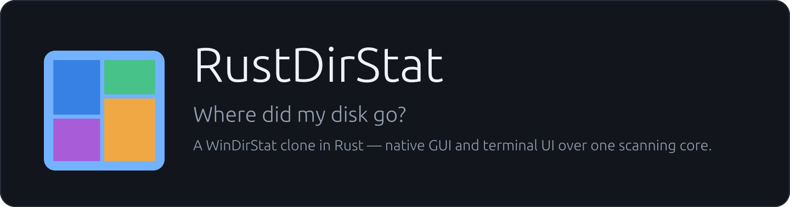
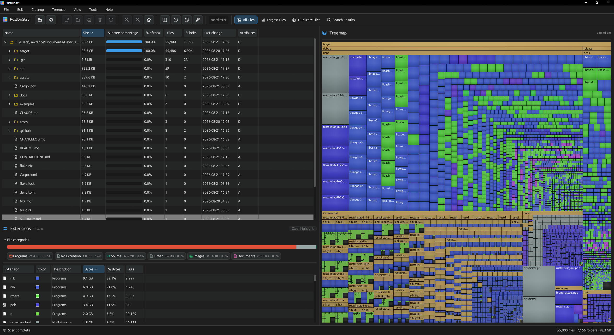
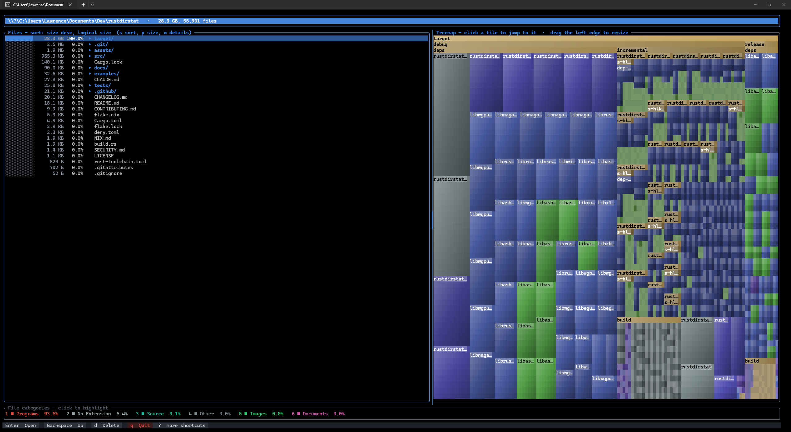

<p align="center">
  
</p>

<p align="center">
  <a href="https://github.com/lnorton89/rustdirstat/actions/workflows/ci.yml"></a>
</p>

A cross-platform clone of [WinDirStat](https://windirstat.net/), written in
Rust, with both a native desktop GUI and a terminal UI.

It scans a directory tree and gives you the same "why is my disk full" workflow
WinDirStat is known for: a sortable size-ranked file list, a squarified,
recursively-nested treemap for spotting the few things eating all your space
at a glance, and a breakdown by file type. Two front ends share one scanning
core:

- **`rustdirstat-gui`** — a native desktop window (egui/wgpu) with resizable
  panes, pixel-shaded treemap cushions, drag-to-reorder columns, and native
  file dialogs. This is the closest match to WinDirStat itself.
- **`rustdirstat`** — the same three coupled views in a fast terminal UI,
  styled like an application rather than a bare terminal listing, and fully
  driven by either the keyboard or the mouse. Also does one-shot text and CSV
  reports for scripting.

Both run anywhere Rust does: Linux, macOS, and Windows.

## Screenshots

The desktop GUI — directory tree, extension breakdown, and cushion-shaded
treemap, linked so acting in any one follows in the others:

<p align="center">
  
</p>

The terminal UI, the same three coupled views over the same scanning core:

<p align="center">
  
</p>

## Features

- Size-ranked, sortable directory tree with per-subtree percentage bars
  and file-type breakdowns computed once at scan time
- Squarified, recursively nested treemap — click a tile to jump to it,
  however deep it is
- Search the whole scan by glob or regex, list the largest files, and find
  duplicate files by content hash — hard-link aware, so two names for one
  file are never counted as reclaimable space
- Logical vs. physical (on-disk) size everywhere, and "physical" means
  what the filesystem says rather than what is convenient to ask for: on
  Unix it is allocated blocks (`st_blocks`, so sparse files and tail
  packing show their real footprint), and on Windows it is the
  allocation size — cluster-rounded, compression- and sparse-aware. NTFS
  answers for a file too small to need a cluster by reporting what it
  really occupies inside the MFT record rather than a cluster it does
  not use, and that answer is passed through as given. This costs no
  extra syscall: the directory listing the scan already performs carries
  it
- Hard links are measured, not guessed at: the totals count each name,
  the way the rows do, and the status bar says how much of that total is
  the same bytes reached through more than one of them. Free on Unix,
  where a file's link count comes with its metadata; opt-in on Windows
  (`--count-hard-links`), where measuring means remembering every file's
  identity for the length of the scan
- Delete to the Recycle Bin/Trash (permanent delete is deliberately
  harder), empty folders with honest partial-failure reporting, move
  across volumes without following symlinks
- Scans stay on one filesystem by default; mount points stay visible as
  markers instead of silently vanishing
- Text and CSV reports for scripting; themes; layout preferences that
  survive restarts; everything long-running stays off the UI thread

## Install

Prebuilt archives for Linux, macOS (Intel and Apple Silicon), and Windows
are attached to each [release](https://github.com/lnorton89/rustdirstat/releases).
Each contains both binaries and a `.sha256` companion file to verify the
download against, and every asset carries a signed build provenance
attestation:

```sh
gh attestation verify rustdirstat-v0.3.0-x86_64-unknown-linux-gnu.tar.gz -R lnorton89/rustdirstat
```

### Linux packages

A `.deb` and an `.rpm` are attached to each release, both holding the two
binaries and built from the same bytes as the archive:

```sh
sudo dpkg -i rustdirstat-v0.3.0-amd64.deb        # Debian, Ubuntu
sudo rpm -i rustdirstat-v0.3.0-x86_64.rpm        # Fedora, openSUSE, RHEL
```

### Package managers

Each release also ships a `package-manifests.tar.gz` containing a winget
manifest, a Homebrew formula, and an AUR `PKGBUILD`, generated from the
digests of the assets that were actually built. They are published as
assets rather than checked in because a manifest carrying the previous
release's SHA-256 is worse than no manifest — it installs the wrong bytes
without complaining.

### Nix

```sh
nix run github:lnorton89/rustdirstat            # terminal UI
nix run github:lnorton89/rustdirstat#gui        # desktop GUI
```

The flake wraps the GUI binary with the X11/Wayland/Vulkan/GL paths it
resolves at startup, so it runs without any further setup. See
[`NIX.md`](NIX.md) for installing it into a profile, adding it as a flake
input, and the dev shell.

### Build from source

Requires a recent stable Rust toolchain (install via [rustup](https://rustup.rs)).

```sh
cargo build --release
./target/release/rustdirstat /path/to/scan
```

On Linux the desktop GUI needs the usual windowing development packages
(`libxkbcommon-dev`, `libwayland-dev`, `libx11-dev`, `libxcursor-dev`,
`libxi-dev`, `libxrandr-dev` on Debian/Ubuntu). The terminal UI needs
none of them.

## Usage

```sh
rustdirstat [PATH...]             # launch the interactive TUI (defaults to '.')
rustdirstat --no-tui [PATH...]    # print a plain-text report instead
rustdirstat --no-tui -t 30 -d 3   # report: top 30 entries per dir, 3 levels deep
rustdirstat --csv out.csv [PATH]  # scan and write a full CSV export instead
rustdirstat-gui [PATH...]         # launch the native WinDirStat-style GUI
rustdirstat-gui C:\ D:\           # or several places at once, as one tree
```

Several paths scan into one tree, each as a top-level entry — the same
choice WinDirStat's opening dialog offers, and the same one the GUI's
**Locations** page offers with the drives listed and their used space
shown. Free space is reported per drive and never added together.

The GUI implements the three coupled views from the installed WinDirStat
1.1.2 reference: an expandable directory tree, exact-extension list, and
interactive treemap. Use the toolbar orientation button (↕/↔) or the
**Treemap** menu to place the treemap below the lists or to their right. Every
splitter can collapse its pane to zero. See
[`docs/WINDIRSTAT_PARITY.md`](docs/WINDIRSTAT_PARITY.md) for the view-by-view
comparison.

Long-running GUI work stays off the frame thread: rescans show live file,
folder, and byte counters while the existing result remains browsable;
duplicate hashing and Windows maintenance commands also run in background
workers. Layout, visibility, sizing mode, and treemap presentation preferences
are restored on the next launch. The directory tree supports right-click
actions and Explorer-style arrow/Enter navigation, and automatically switches
to a compact column set in narrow panes.

| Flag | Description |
|---|---|
| `-n`, `--no-tui` | Print a text report instead of opening the TUI |
| `-t`, `--top <N>` | Entries shown per directory in report mode (default 20) |
| `-d`, `--depth <N>` | Depth of the report tree (default 2) |
| `--count-hard-links` | Measure how much of the total is the same bytes under two names (default on where it is free — Unix) |
| `--csv <PATH>` | Scan and write a full CSV export (one row per file/directory: path, type, size, physical_size, files, dirs, modified, unreadable) instead of opening the TUI |

## TUI keybindings

| Key | Action |
|---|---|
| `↑`/`k`, `↓`/`j` | Move selection |
| `→`/`l`/`Enter` | Open the selected directory |
| `←`/`h`/`Backspace` | Go up a directory |
| `s` | Cycle sort order (size, name, modified — each ascending/descending) |
| `m` | Show/hide file counts and modified dates in the list |
| `t` | Toggle the treemap panel |
| `[` / `]` | Resize the treemap panel (or drag its left edge with the mouse) |
| `f` | Toggle the "biggest files in this subtree" flat view |
| `/` | Search/filter the current directory's direct children by name |
| `S` | Search the entire current subtree by name — glob (`*`, `?`, `[a-z]`, `{jpg,png}`), or `re:` for a regular expression |
| `u` | Find duplicate files (by content hash) across the whole scan |
| `p` | Toggle logical vs. physical (on-disk) size everywhere |
| `1`-`9` | Highlight a file-type category in the treemap |
| `0` | Clear the highlight |
| `o` | Open the selected item — its default app for a file, the file manager for a folder |
| `O` | Reveal the selected item in the OS file manager |
| `y` | Copy the selected item's full path to the clipboard |
| `M` | Move the selected item to another folder |
| `i` | Show properties (path, size, type, counts, modified) for the selected item |
| `T` | Windows system tools (Disk Cleanup, DISM, shadow copies, ...) |
| `r` | Rescan from the root (keeps your current location) |
| `e` | Export a text report of the current view to a file |
| `E` | Export a full CSV of the current view's subtree to a file |
| `d` | Delete the selected item — moves it to the Recycle Bin/Trash |
| `D` | Delete **permanently**, bypassing the Recycle Bin/Trash |
| `d`, then `e` | In the delete popup, empty a folder instead — keep it, delete its contents |
| `?` | Toggle the in-app help screen |
| `q`, `Esc` | Quit |

## Mouse

Every action above also works with the mouse — nothing is keyboard-only
(except `D`, permanent delete, which is deliberately kept off any clickable
surface):

- **Click a treemap tile** to jump straight to it: the file list navigates
  to (and selects) whatever you clicked, exactly like WinDirStat's linked
  list/treemap selection, however deep the tile is nested.
- **Click a list row** to select it (or a "biggest files" row to jump to
  it); click it again quickly to open it (double-click), or scroll the
  wheel to move the selection.
- **Click the extension legend** to highlight that category in the treemap.
- **Click the "Files" title bar** to cycle sort order, the **treemap title
  bar** to toggle the panel, and the **header** to go up a directory.
- **Drag the border between the list and the treemap** to resize them,
  like any GUI split pane. It's marked with a permanent accent-colored bar
  rather than only lighting up on hover — a terminal program has no way to
  change the OS mouse cursor, and detecting hover at all would mean turning
  mouse-motion tracking back on, which is exactly what was removed to fix
  the unresponsive-after-idle bug above.
- **Click the footer buttons** (Open, Up, Delete, Quit, and "more
  shortcuts" for the rest), or the **Yes/No buttons** in the delete
  confirmation popup.

## Cleanups

Your own commands, run against whatever is selected — WinDirStat's
"Cleanups". Nothing is configured by default; add them to the config file
described under [Preferences](#preferences):

```toml
[[cleanups]]
name = "Open a terminal here"
program = "wt"
args = ["-d", "%d"]
capture_output = false

[[cleanups]]
name = "Compress with 7-Zip"
program = "7z"
args = ["a", "-tzip", "%p.zip", "%p"]
```

`%p` is the full path, `%n` the file name, `%d` the containing folder,
and `%%` a literal per cent. Arguments are a list, and **no shell is
involved**: a file name containing spaces, quotes or semicolons is passed
as data, not parsed as syntax. Every cleanup asks before it runs (set
`confirm = false` to opt out, per cleanup) and the confirmation shows the
exact command, after substitution.

The reasoning, including what a hostile file name can and cannot do here,
is in [`docs/CLEANUPS_THREAT_MODEL.md`](docs/CLEANUPS_THREAT_MODEL.md).

## Language

The window reads its text from a message catalogue. English ships
compiled in; anything else is a file you drop into `lang/` beside the
config, named for its language tag:

```
<config>/rustdirstat/lang/de.toml
```

A translation is a copy of [`assets/lang/en.toml`](assets/lang/en.toml)
with the right-hand sides replaced. **Partial translations are useful**:
any key a catalogue does not define falls back to English, so ten
translated lines are ten translated lines rather than a broken UI. Pick
the language under *Appearance*; the choice is remembered.

`assets/lang/de.toml` is a deliberately partial German catalogue — enough
to see the mechanism working end to end, and a starting point for anyone
who wants to finish it.

Coverage today is the menus, the view names, the status bar, the settings
pages and the Properties inspector. The rest of the app is still English
literals; `docs/ROADMAP.md` names the modules that remain.

## Preferences

Sort order, the treemap panel's visibility and width, the detail-row
toggle, and the logical/physical size toggle are remembered across runs —
saved to a small TOML file on quit (`$XDG_CONFIG_HOME/rustdirstat/config.toml`
on Linux, the platform-equivalent config directory elsewhere) and reapplied
on the next launch. Nothing tied to a specific scan (browse location,
filters, search state) is persisted — only settings, not session state. A
missing or unreadable config file is silent and harmless: it just means
this run starts from the built-in defaults.

## Design

Both front ends draw the same three coupled views. The notes below are
about the TUI, where screen space is scarcest; the GUI follows the same
principles with a real window to spend.

The default view is deliberately spare — one accent color for navigation,
plain text for file names, a handful of footer buttons — because a screen
that colors and labels everything ends up highlighting nothing. Anything
extra is opt-in rather than always-on:

- File/dir counts and modified dates are hidden until you press `m`.
- The treemap favors a few large, legible tiles over exhaustively nesting
  every subdirectory into illegible fragments.
- The footer shows only the handful of actions used constantly; the rest
  are one keystroke away and listed in `?`.
- Color is reserved for where it's informative — the treemap, the
  extension legend, and highlighting — not sprayed across every row.

### The mark


The icon is the app's own subject matter: four tiles squarified into a
frame, which is what the treemap does to a directory of mixed sizes. It
is defined once — geometry and colour — in [`src/brand.rs`](src/brand.rs),
and everything that shows it reads from there. The window and taskbar
icon rasterises it, the mark beside the product name in the toolbar and
the About card paints it as vectors, and the PNGs in
[`assets/brand/`](assets/brand) are the same call at 32 through 512.

<br clear="left">

Those PNGs are generated, not drawn, so regenerate them rather than
editing them:

```sh
cargo run --example brand_assets
```

The mark is also the one thing in the GUI that does not come from the
active theme. Everything else is interface and restyles with the theme;
the mark is identity, and a logo that changes colour under a dark theme
is not a logo.

Being cross-platform doesn't mean every feature has to work everywhere.
The `T` Windows tools menu (Disk Cleanup, DISM component-store cleanup,
shadow copies, ...) has no equivalent concept on Linux or macOS — there's
no universal "shrink WinSxS" — so it's genuinely Windows-only code,
`cfg(windows)`-gated. But the menu itself is always present: on other
platforms every entry shows up grayed out with a note that it needs
Windows, rather than the whole feature category quietly not existing. A
cross-platform app can still carry a platform-specific feature subset
without pretending that subset isn't there for everyone else.

## Performance

Built to stay responsive on very large trees (tested against directory
trees in the hundreds-of-thousands-of-files range; designed for
multi-million-file, multi-hundred-GB drives):

- **No per-node paths.** Nodes store only their own name, not a full
  absolute path — a `PathBuf` on every node would duplicate its entire
  ancestor chain, dominating both scan time and memory on a huge tree.
  Paths are reconstructed on demand (open, delete, display) by walking down
  from the root, which is cheap and only needed for a handful of operations,
  not for every node.
- **O(1) extension stats.** Each directory's file-type breakdown is rolled
  up bottom-up once during scanning, so opening even a directory with
  millions of descendants doesn't re-walk its subtree just to show what's
  in it — it's a direct array read.
- **Precomputed categories.** A file's type bucket is computed once at scan
  time (as a small `Copy` enum, not a `String`), not re-parsed from its
  extension on every frame it's rendered.
- **Sequential scanning for small directories.** Most real directories are
  small; spinning up parallel tasks for a handful of entries costs more in
  scheduling overhead than it saves, so only directories above a size
  threshold get parallelized with `rayon`.
- **Batched progress updates.** Scan progress counters are updated once per
  directory, not once per file, to avoid dozens of threads contending the
  same atomic on every single entry.
- **Event-driven redraws.** The UI only redraws in response to actual input
  (or mouse scroll), not on a fixed timer — nothing in the interface
  animates, so polling and recomputing the treemap layout on a clock would
  just waste CPU.
- **Bounded "biggest files" search.** Finding the largest files across a
  huge subtree uses a streaming bounded min-heap, not collect-then-sort, so
  it costs O(k) memory instead of O(n).

The GUI is immediate mode, so it rebuilds the whole window every frame.
That adds three constraints the TUI doesn't have:

- **Derived views are cached, not recomputed per frame.** The flattened
  row list and the treemap tile list are rebuilt only when something they
  depend on actually changes. Both caches are keyed off observed state
  rather than invalidated by hand, so they can't go stale.
- **Trees are freed off-thread.** Dropping a whole-drive scan means
  returning millions of allocations and takes over a second even with
  everything resident — far longer once it's been paged out. Rescans and
  exit hand the old tree to a background thread instead of walking it on
  the UI thread, which is what kept closing the window after a full C:
  scan from looking like a hang.
- **The treemap tile budget is spent level by level.** Spending it
  depth-first lets the leftmost subtree consume the whole budget before
  its siblings are reached, which on a large volume left the right-hand
  side of the treemap blank. Working level-order makes full coverage an
  invariant instead.

[`docs/PERFORMANCE.md`](docs/PERFORMANCE.md) has the measurements and the
reasoning; [`docs/ARCHITECTURE.md`](docs/ARCHITECTURE.md) has the module
map.

## How it works

- **Scanning** walks the directory tree with a `rayon`-parallelized recursive
  descent, aggregating size, file/dir counts, and extension totals bottom-up.
  It never follows symlinks (avoiding cycles), and directories it can't read
  are flagged rather than aborting the whole scan.
- **Treemap** recursively lays out each directory's *entire* subtree (not
  just its immediate children) using the squarified treemap algorithm
  (Bruls, Huizing, van Wijk), nesting a directory's own layout inside the
  rectangle it was allotted by its parent — so a folder that dominates its
  parent still shows real internal structure instead of one flat block.
  A directory keeps recursing into its actual files for as long as its
  tile has room for even one child cell — not just down to some fixed
  depth or size threshold — since most real filesystems are directory-heavy
  near the top (you pass through several folders before reaching whatever
  actually takes up space), and a depth cap left large swaths of the map as
  flat, undifferentiated directory-colored blocks even with plenty of room
  to show more. Only the text *label* is size-gated, so a small tile still
  contributes its real color, just without illegible text on top of it.
  Every tile gets a border so same-colored siblings stay visually separate,
  and directories use a neutral tan rather than a file category's color —
  color is reserved for what it actually differentiates.
- **Unreadable entries are counted, not dropped.** A directory listing or a
  file's metadata lookup can fail mid-scan (a permission edge case, a race
  with something else deleting it) without the whole scan failing. Rather
  than silently omitting those entries from every size/count total — which
  would make a partial subtree look identical to a complete one — a running
  count is kept and surfaced as a warning in the header and against the
  affected row, so an undercount is visible instead of silent.
- **Deletes** move to the OS Recycle Bin/Trash by default (`trash` crate,
  cross-platform); permanent deletion is a separate, deliberately
  keyboard-only action. Either way, the in-memory tree's aggregate sizes,
  counts, and extension totals are updated directly, so there's no need to
  rescan after cleaning something up.
- **Refresh (`r`)** rescans from the root and restores your browsing
  location by path, rather than discarding your place in the tree.
- **Mouse and keyboard input share one dispatch path**: every action is a
  variant of an `Action` enum, and both a key press and a click on a
  registered screen region just produce an `Action` and hand it to the same
  handler — so there's no divergent mouse-only or keyboard-only behavior.
- **Mouse tracking is click/scroll/drag only.** Enabling mouse support the
  default way (crossterm's `EnableMouseCapture`) also turns on
  report-every-motion tracking, so the terminal streams an event for every
  pixel the pointer travels — including while the window is unfocused, for
  as long as it happens to rest over it. Left idle for a long stretch, that
  can queue an enormous backlog of stray events ahead of whatever's typed
  next, which could make the app appear to stop responding to `q`. Mouse
  capture is enabled with a narrower escape sequence instead, covering
  everything the app actually uses (clicks, drag, scroll) without the
  motion flood.
- **Input polling avoids a real crossterm bug.** crossterm's default Unix
  input backend (`mio`/epoll) registers the terminal fd edge-triggered but
  doesn't drain it to `EAGAIN` before returning an event — once more than
  ~1KB of input arrives in one burst (a terminal replaying buffered input
  after being left idle, or a large queued backlog), everything past that
  point is silently dropped and epoll never wakes up for it again, hanging
  the app until new input arrives from elsewhere. The `use-dev-tty`
  feature switches to a level-triggered `poll(2)`-based backend that can't
  get stuck this way. Caught and regression-tested in
  `tests/quit_stress.rs`, which drives the real binary through an actual
  pty under a synthetic event flood.
- **Redraws are batched per input burst, not per event.** The event loop
  drains every already-queued input event before redrawing once, rather
  than doing a full list/treemap relayout per event — on a huge tree, a
  large backlog processed one redraw at a time can take long enough to
  feel like the app isn't responding, even though it was always going to
  get there eventually.

## Contributing

Contributions are welcome — bug reports, feature requests, and pull
requests alike. See [`CONTRIBUTING.md`](CONTRIBUTING.md) for how to build
and test the project, the rules the codebase enforces, and what a pull
request needs before it can land. Security issues are handled privately —
see [`SECURITY.md`](SECURITY.md).

## License

MIT
